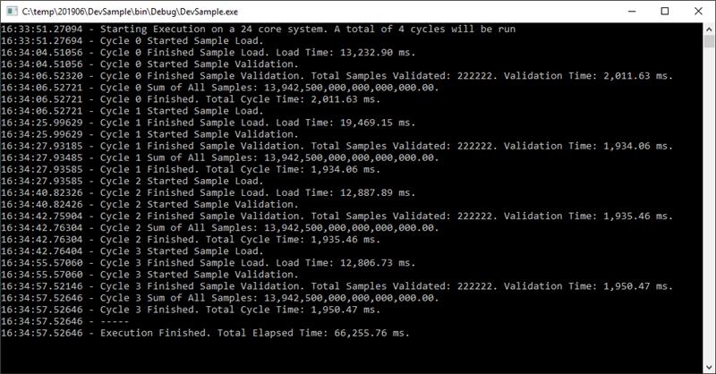

# java-concurrency-lab
Java version of a Performance Improvement and Refactoring Code Lab.

The purpose of this code lab is to improve the performance of a slow and buggy code by introducing java concurrency pattern and techniques.

## Scenario
Application loads a set of sample records, runs some validation on them, and then sums up all of the values and displays the results. Each step is written to the console along with how long it took, and the output currently looks something like this:

For unknown reasons, the application needs to run ½ as many cycles as logical CPU cores, but doesn’t need to run more than 4 cycles.

Task is to resolve the bugs and optimize the code so it completes faster. 

The bugs that were identified are:
- the lack of precision on the Sum that’s displayed.
- the total cycle time displayed is wrong.
- it’s supposed to write the output to a text file but that doesn’t appear to be working.

It's irrelevant what order the cycles run in or are logged, as long as the sample validation counts/total sums are consistent across the cycles and it executes a lot faster.